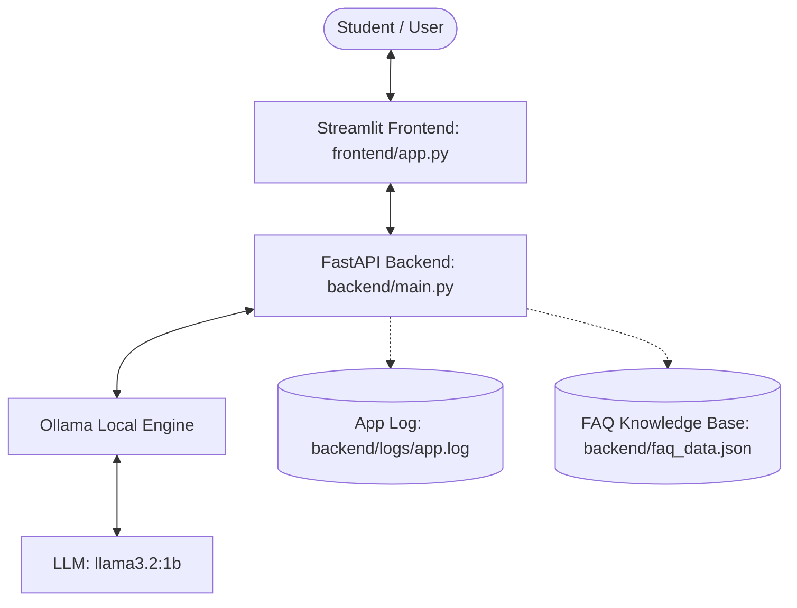

# Implementation Plan: University Student Support Assistant

This document outlines the proposed step-by-step implementation plan for the **University Student Support Assistant** assignment. The system will integrate a local LLM via Ollama, a FastAPI backend, and a Streamlit frontend.

---

## 1. Expected Architecture & Flow



---

## 2. Directory Structure

We will adhere to the following file layout:

```
support-assistant-llm/
├── backend/
│   ├── main.py            # FastAPI endpoints, logging, and error handling
│   ├── llm_client.py      # Ollama API client & simple RAG logic
│   ├── config.py          # Port config, model configurations, Ollama URL
│   ├── faq_data.json      # FAQ data for the Simple RAG option
│   └── logs/
│       └── app.log        # Interaction log (timestamp, Q&A, errors)
├── frontend/
│   └── app.py             # Streamlit interactive dashboard
├── tests/
│   └── test_api.py        # Automated backend API testing script
├── docs/
│   ├── screenshots/       # Evidence screenshots for submission
│   └── report.md          # Technical report draft and answers to reflection questions
├── requirements.txt       # Dependencies list (FastAPI, Streamlit, etc.)
├── PLAN.md                # Project execution plan (This file)
└── README.md              # Project instructions and usage guide
```

---

## 3. Step-by-Step Execution Plan

### Phase 1: Environment & Tooling Setup
1. **Virtual Environment**: Create and activate a Python virtual environment (`.venv`).
2. **Dependencies**: Create a `requirements.txt` with:
   - `fastapi`, `uvicorn` (Backend API)
   - `streamlit` (Frontend UI)
   - `requests` (API requests & testing)
   - `pydantic`, `pydantic-settings` (Config validation)
   - `httpx` (Asynchronous HTTP requests)
3. **Local LLM**:
   - Pull `llama3.2:1b` using Ollama (`ollama pull llama3.2:1b`).
   - Validate model responsiveness locally.

### Phase 2: Configuration & Backend Development
1. **Config**: Write `backend/config.py` to load environment variables/settings (e.g. host, port, Ollama base URL, model name).
2. **LLM Client**: Write `backend/llm_client.py` using `httpx` to send chat requests to the Ollama endpoint.
3. **FastAPI App (`backend/main.py`)**:
   - Configure centralized logging to `backend/logs/app.log`.
   - Setup CORS middleware to allow communication from the frontend.
   - Implement the `/health` endpoint (checks backend readiness and tests if Ollama is accessible and the model is loaded).
   - Implement the `/ask` endpoint (receives student questions, interacts with the LLM, logs the interaction, and returns responses).
   - Setup custom exception handlers for Ollama connectivity issues.

### Phase 3: Frontend Development (`frontend/app.py`)
1. **UI Layout**: Use Streamlit to create a modern web chat interface.
2. **Loading States**: Add spinner overlays (`st.spinner`) to indicate backend processing for slow responses.
3. **Error Handling**:
   - Detect if Backend is offline and display a clean connection error badge.
   - Return visual warnings if the LLM model is not running.
   - Block empty inputs with helpful input prompts.
4. **Interactive Ratings (Option E Extension)**:
   - Provide a mechanism for students to evaluate LLM responses: **Good / Average / Poor**.
   - Append user feedback metadata to a JSON/CSV file for analysis.

### Phase 4: Simple RAG Integration (Option B Extension)
1. **Knowledge Base**: Store common university questions and answers (e.g. course registration schedules, hostel deadlines, exam codes) inside `backend/faq_data.json`.
2. **Retriever**: Implement a simple keyword or TF-IDF matching function in `backend/llm_client.py`.
3. **Augmentation**: Retrieve the top-1 relevant FAQ QA pair and inject it as context into the prompt sent to the LLM (e.g., `"Use the following context to answer the student's question: [context]"`).

### Phase 5: Automated Testing (`tests/test_api.py`)
1. Create a script to run automated tests.
2. Test both positive test cases (successful `/health` check and a sample `/ask` request) and negative cases (e.g. sending empty questions, testing behavior when Ollama is stopped).

### Phase 6: Report and Screenshot Evidence
1. Write a markdown draft (`docs/report.md`) detailing:
   - Introduction and Use Cases.
   - System Architecture diagram.
   - Implementation steps.
   - Answers to the 10 reflection questions in the assignment sheet.
2. Provide guidance to easily run components and take the 8 necessary screenshots required by the assignment sheet.

---

## 4. Feedback & Adjustments

Please review this plan. You can request changes to:
- The chosen local model (defaulting to `llama3.2:1b`).
- The choice of frontend (Streamlit is chosen for its simplicity and Python alignment).
- The optional extensions (Simple RAG and Response Evaluation are proposed to secure maximum grades).
